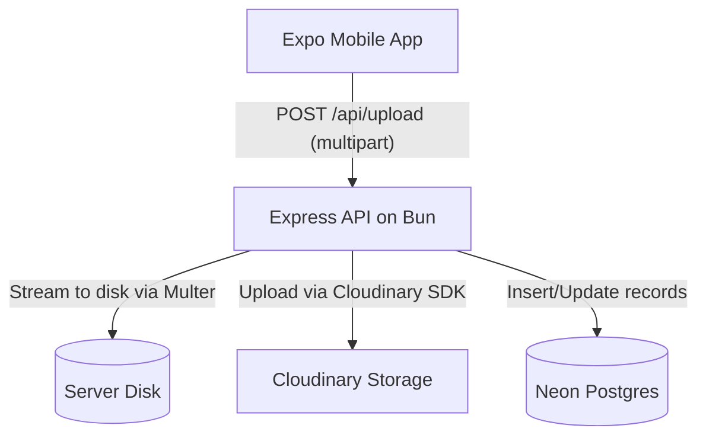

# Backend Architecture

The backend is built with **Bun** and **Express**. It handles the API layer for uploading documents, polling status, and persisting records via **Drizzle ORM** and **Neon Serverless Postgres**.

## System Architecture



## File Upload Process (Disk Buffering)
To avoid RAM exhaustion when uploading large files (e.g., > 100MB), the backend utilizes **disk buffering** via `multer`.
1. The client sends a `multipart/form-data` request with a PDF.
2. `multer` writes the file directly to the server's temporary directory (`os.tmpdir()`), keeping memory usage strictly low.
3. The server inserts a `processing` record in the `uploads` table.
4. The server uses the Cloudinary SDK to stream the file from the disk to Cloudinary (`resource_type: "raw"`).
5. The local temporary file is immediately deleted.
6. A record is inserted into the `documents` table with the Cloudinary URL.
7. The `uploads` table record is marked `complete` and linked to the `documents` record.

## Database Structures

The Drizzle schema maps closely to the Zod contracts used by the client.

| Table Name | Description | Key Fields |
| --- | --- | --- |
| **`documents`** | Successfully processed files | `id`, `name`, `size`, `mimeType`, `url`, `storageKey` |
| **`uploads`** | The status of an ongoing upload task | `id`, `status` (queued/uploading/processing/complete/failed), `documentId` (foreign key) |
| **`notifications`** | Alerts to display in the UI | `id`, `type`, `message`, `read` |

## Cloudinary Setup Guide

We use **Cloudinary** for persistent, off-server file storage. The mobile app fetches documents from their public Cloudinary URLs.

### Step 1: Create an Account
1. Go to [Cloudinary](https://cloudinary.com) and create a free account.
2. Once logged in, go to the **Dashboard** or **API Keys** section.

### Step 2: Configure Environment Variables
You will need your `Cloud Name`, `API Key`, and `API Secret`.
Copy `service/.env.example` to `service/.env` and fill in the values:

```env
STORAGE_PROVIDER=cloudinary
CLOUDINARY_CLOUD_NAME=your_cloud_name
CLOUDINARY_API_KEY=your_api_key
CLOUDINARY_API_SECRET=your_api_secret
CLOUDINARY_FOLDER=docmanager
```

The server is configured to automatically pick up these credentials on startup via the Zod schema validation in `service/src/env.ts`.
